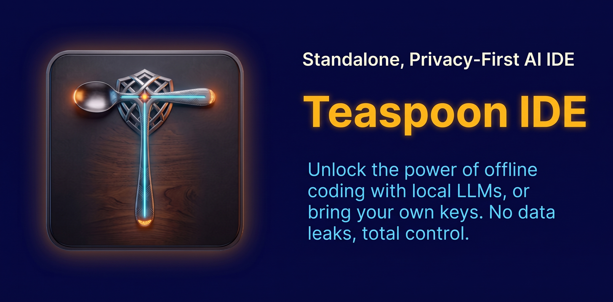

# Teaspoon IDE

English | [日本語](README.ja.md)

<p align="center">
  
</p>

A standalone Electron-based AI coding assistant that combines a file explorer, code editor, AI chat, Git operations, and a terminal in one app.

The name **Teaspoon IDE** reflects the design goal: getting real work done on a teaspoon of tokens. The default context is just the file tree (path list), and the AI fetches file contents on demand via READ_FILE/GREP — keeping each message small.

The package and repository name is `teaspoon-ide`. The product/display name is **Teaspoon IDE**. (Formerly known as **Forger**.)

<video src="https://github.com/user-attachments/assets/867c8bcc-93aa-4ee4-90ef-efde5ed735e1" controls width="100%"></video>

Author: Eiji Arai — Web Site: https://cuculhart.com

## Features

### Project Management

- **Open Project**: Open any folder as a project via the folder picker
- **New Project**: Create a project with a name and parent folder
- **Recent Projects**: Lists frequently/recently opened projects for one-click reopen
- **Session Restore**: Automatically restores the last project, open file, and chat history after reload or restart
- **Create Files/Folders**: Inline creation via the 📄+/📁+ buttons in the explorer or the File menu
- **Drag & Drop**: Drop a folder onto the exe or the app window to open it as a project (`Teaspoon.exe <path>` also works; a second launch hands off to the running instance)

### Editor

- **Monaco Editor**: Language auto-detection, minimap, syntax highlighting (locally bundled — works offline)
- **Save**: Ctrl+S / File > Save
- **Undo/Redo**: Menu and shortcut support (integrated with Monaco's internal history)
- **Diff View**: Click a changed file in the Git panel to see a side-by-side diff against HEAD
- **Quick Open**: Ctrl+P (File > Quick Open) — fuzzy file-name search and recently opened files
- **Full-Text Search**: Project-wide regex-capable search from the sidebar "Search" tab; click a result to jump to the line

### AI Chat

- **Agent Loop**: The AI issues file-operation commands and works autonomously over multiple steps with feedback (list → read → edit)
- **Context Management**: Sends the file tree (path list) by default for low token usage; the AI fetches file contents on demand via READ_FILE/GREP. Manual file selection mode is available via the 🧠 button; mode and limits are configurable in Settings > AI Context
- **Safe Write Control**: Writes are restricted to the project root; writes outside are rejected
- **Per-Project Chat Persistence**: Conversations are saved per project and restored on reopen
- **Checkpoints & Rollback**: Snapshots are taken before AI writes; "↩ Rollback" restores only AI-touched files
- **Create-project prompt**: If the AI tries to write a file while no project is open, a dialog offers to create a project folder (default parent: Documents) and the file operation continues there
- **Retry / Cancel / Timeout / Response-length limits** supported

### Git

- **Source Control Panel**: Branch display, ahead/behind counts, changed-file list with status badges
- **Stage & Commit**: Select files via checkboxes or commit all changes at once
- **Push / Pull**: From the toolbar; a first push can set upstream automatically when the target remote is unambiguous
- **Clone**: Enter a repository URL from the Open Project dialog, or clone into an empty open project folder
- **Remote Setup**: Add or update remotes, create the initial commit when needed, then push a branch with upstream tracking
- **Repo Init**: Run `git init` on a non-Git folder
- **Git Config**: Set `user.name` and `user.email` globally or per repository

### Terminal

- **Command Execution**: Runs commands with the project root as the working directory (`npm install`, `npm start`, `docker compose up`, etc.)
- **Multiple Processes**: Keep a long-running process alive while running other commands
- **True TTY (node-pty + xterm.js)**: Send keystrokes to interactive CLI programs (REPLs, prompts). ANSI colors and cursor control are rendered
- **Process Stop**: Stop button terminates the process tree (equivalent to `taskkill /T /F` on Windows)
- **URL Detection**: Click `http://localhost:...` in the output to open it in a browser
- **AI-issued Commands**: `// RUN_COMMAND:` always requires user approval; stdout/stderr and the exit code are fed back to the AI

### Markdown

- **Preview**: Toggle Preview/Edit for `.md` files in the editor header (marked + DOMPurify, GFM support)
- **Export**: Export to a self-contained HTML file or PDF (Electron `printToPDF`) — buttons in the editor header or File menu. No extensions or Pandoc required

### Appearance & Settings

- **Theme**: System (follows OS via nativeTheme) / Dark / Light, plus 12 named themes: Organic Light, Muted Ocean, Ancient Console, Walnut, Heritage, Rich Wine, Violet Fizz, Otegami, Soda Float, Modern Syntax eXtensible (MSX), Chaya, Coquette
- **Font**: Family and size applied across the UI and Monaco
- **LLM Provider**: Switch between Gemini API (cloud) and Ollama (local, offline) in Settings. Model selection and LiteLLM proxy supported
- **UI Language**: Switch in Settings > Appearance > Language. Add `lang/<code>.json` to contribute a language — keys are the English source strings
- **Chat focus**: focus toggle in the chat header (⛶ to enter, ◫ to restore panes) or View > Toggle Chat Focus (Ctrl+Shift+B) hides the sidebar/editor/terminal so the chat fills the window; IDE panes return on menu actions that need them, and the mode is remembered across restarts
- **Chat list**: while chat focus is on, a conversation rail appears beside the chat (list | conversation). Chats are persisted per conversation — including ones started with no project open — as JSON files under userData/chat-history; long chats are compacted into a rolling summary so requests stay within model context limits
- **About**: Help > About Teaspoon IDE
- **Native Menus**: File / Edit / View / Window / Help

## Architecture

```
Electron App
├── Main Process (Node.js)
│   ├── Window management / native menus
│   ├── File system access
│   ├── Folder picker dialog
│   ├── nativeTheme (theme integration)
│   ├── Terminal/PTY (node-pty)
│   └── Git operations (simple-git)
├── Renderer Process (React/TypeScript)
│   ├── Explorer / Git panel / Search (sidebar tabs)
│   ├── Editor pane (Monaco / DiffEditor)
│   ├── Chat pane (agent loop)
│   ├── Terminal pane (xterm.js)
│   └── Context management / i18n services
└── LLM Integration
    ├── Gemini API
    ├── Ollama (local, offline)
    ├── LiteLLM proxy (optional)
    └── File-operation commands (agent loop)
```

## Security Architecture

Using a LiteLLM proxy is recommended for safe API-key management:

```
Teaspoon IDE → dummy API key → LiteLLM (e.g. VPS) → real API key → Google AI Studio
```

### Setting up the LiteLLM proxy

1. **Set up a LiteLLM server** (e.g. on a VPS):
```bash
pip install litellm
litellm --model gemini/gemini-3.8-flash --api_key YOUR_REAL_API_KEY
```

2. **Configure Teaspoon IDE**:
   - Enable "Use Proxy" in Settings
   - Enter the proxy URL (e.g. `http://your-vps:4000`)
   - Enter a dummy API key (it is not actually used)

3. **Benefits**:
   - The real API key is never stored on the client
   - Easy key rotation
   - Usage monitoring and limits
   - Unified access to multiple AI providers

For fully offline operation, choose the **Ollama** provider — no API key or network access is needed at all.

## Distribution Model

This app is distributed standalone as **source-available** software (license: FSL-1.1-MIT — see the License section).

- **Development**: `npm run dev` starts the Vite dev server (localhost:5173) + Electron
- **Distribution**: Packaged with Electron Forge; users download and run an installer/zip locally (no dev server needed)

### CSP Policy

`index.html`'s Content Security Policy allows connections to `localhost`, but this is an allow-list, not a requirement. It is harmless in packaged builds and is what permits the Ollama provider (`http://localhost:11434`) to connect.

### Chat and Projects

Currently "1 project : 1 chat" — conversations are persisted as JSON files under `userData/chat-history` (including chats started with no project open). Internally they are kept as project → conversation list, so extending to multiple chat tabs is straightforward.

### Packaging

`npm run package` produces `out/Teaspoon-win32-x64/Teaspoon.exe` (portable); `npm run make` produces a Squirrel installer.

Implemented packaging work:

- `electron/main.js` — loads `dist/index.html` via `loadFile` when `app.isPackaged`
- CSP — strict policy for production builds only (swapped in via `transformIndexHtml` in `vite.config.ts`; removes `'unsafe-inline'` scripts, CDN, `ws:`)
- Monaco Editor — locally bundled via `src/monacoSetup.ts` (workers included; no CDN, works offline)
- node-pty — `.node` binaries unpacked from the asar via `asar.unpack`
- Fatal main-process errors are logged to `%TEMP%/teaspoon-crash.log` (packaged builds have no console)

## Tech Stack

- **Framework**: Electron + React + TypeScript
- **Editor**: Monaco Editor
- **Git**: simple-git
- **Terminal**: node-pty + xterm.js
- **LLM**: Gemini API / Ollama (local)
- **Build**: Vite + Electron Forge
- **Settings**: ConfigService + localStorage
- **Proxy**: LiteLLM (optional)
- **Node.js**: v22 LTS recommended

## Getting Started

### Prerequisites

- Node.js v22 LTS (recommended)
- npm
- Git (for the Git panel)

On Linux/macOS, if your distro's Node is older than v22, install v22 with
a version manager:

```bash
# Option A: n
npm install -g n
n 22

# Option B: nvm
nvm install 22 && nvm use 22
```

### Install

```bash
git clone https://github.com/cuculhart/teaspoon-ide.git
cd teaspoon-ide

# Install dependencies
npm install

# Run in development mode
npm run dev
```

## Usage

### Open / Create a Project

1. Launch the app
2. Click the 📂 button in the Explorer
3. "Select Folder" opens an existing folder; "New Project" creates one
4. You can also reopen from Recent Projects, or drop a folder on the exe/window

### Using AI Chat

1. Open Settings (⚙️)
2. Choose an LLM provider:
   - **Gemini API**: Enter your API key and pick a model (default: gemini-3.8-flash). Optionally configure a LiteLLM proxy
   - **Ollama**: Start Ollama locally, then pick the endpoint and model (installed models are auto-detected)
3. Send a message in the chat

### Context Management

- **Auto mode**: Sends the file tree (paths); the AI reads file contents on demand via tools
- **Manual mode**: Click the file-select buttons in the Explorer to add files to the AI context
- Toggle modes with the 🧠 button; configure in Settings > AI Context

### AI File Operations

Tell the AI to "create a file" or "edit ○○" and it issues file-operation commands that the app executes:

- `// LIST_FILES: <dir>` — List files in a directory
- `// READ_FILE: <path>` — Read a file
- `// GREP: <pattern>` — Project-wide content search (regex or substring); returns `file:line: text`
- `// FIND_FILES: <pattern>` — Search file names/paths by glob (`*.ts`) or substring
- `// WRITE_FILE: <path>` + `// END_WRITE_FILE` — Create/overwrite a file (via approval dialog)
- `// EDIT_FILE: <path>` + `<<<<<<< SEARCH` / `=======` / `>>>>>>> REPLACE` + `// END_EDIT_FILE` — Partial diff edit (multiple blocks allowed, via approval dialog)
- `// RUN_COMMAND: <command>` — Run a shell command (via approval dialog; interactive commands work through the PTY)
- `// CLOSE_PROJECT` — Close the open project (no arguments; same as File > Close Project, no approval needed)

Results are fed back to the AI, which works autonomously over multiple steps and returns a natural-language summary when done.

**Safety**: Writes are limited to paths inside the project root. Writes outside the project are rejected.

### Git Operations

1. Open the "Git" tab in the sidebar
2. Clone a repository from File > Clone Repository / the Open Project dialog, or for a new empty project choose Clone / Initialize Git
3. Use ⇄ to add/update a remote. If the repository has no commits yet, use Initial Commit, then push the current branch with upstream tracking; use ⚙ for `user.name` / `user.email`
4. Review changed files (click a file name to see the diff)
5. Enter a commit message and Commit (checked files only, or all changes)
6. Use ↑/↓ buttons to Push/Pull; Push sets upstream automatically when the remote is unambiguous

## Development

```bash
# Development mode
npm run dev

# Production build
npm run build

# Preview
npm run preview
```

## License

FSL-1.1-MIT (Functional Source License) — Copyright 2025 Eiji Arai (see [LICENSE](LICENSE))

- **Source-available**: Free to view, modify, fork, and use personally or internally
- **Restriction**: No Competing Use — you may not offer the software as a competing commercial product or service (e.g. selling a renamed clone)
- **Converts to MIT**: Each release automatically becomes MIT-licensed 2 years after publication
- The "Teaspoon IDE" name is governed separately (see the Trademark clause)

Teaspoon IDE is built on open-source components (Monaco Editor, Electron, React, xterm.js, etc.). See [THIRD_PARTY_LICENSES.md](THIRD_PARTY_LICENSES.md) for each component's license and copyright holder. Packaged builds ship these files under `resources/`.
